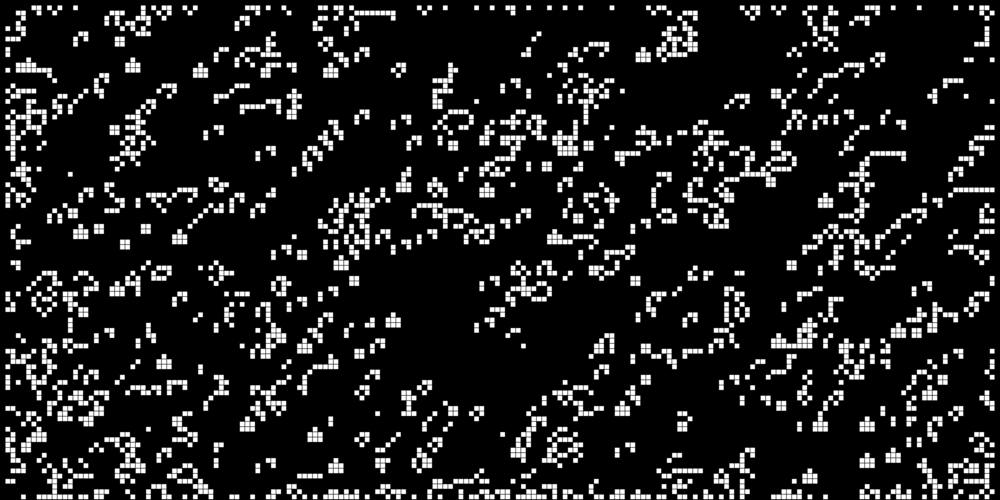

# Game of life

This is my version of [Conway's game of life](https://en.wikipedia.org/wiki/Conway%27s_Game_of_Life) using [P5js](https://p5js.org/).

## The idea
The idea of making this game came from this [coding train](https://thecodingtrain.com/) video:

and [this article](https://www.quantamagazine.org/maths-game-of-life-reveals-long-sought-repeating-patterns-20240118/) from [Quanta Magazine](https://www.quantamagazine.org/).

So after that, I decided to do my own version in JS that you can check [here](https://game-of-life-eta-one.vercel.app/).
